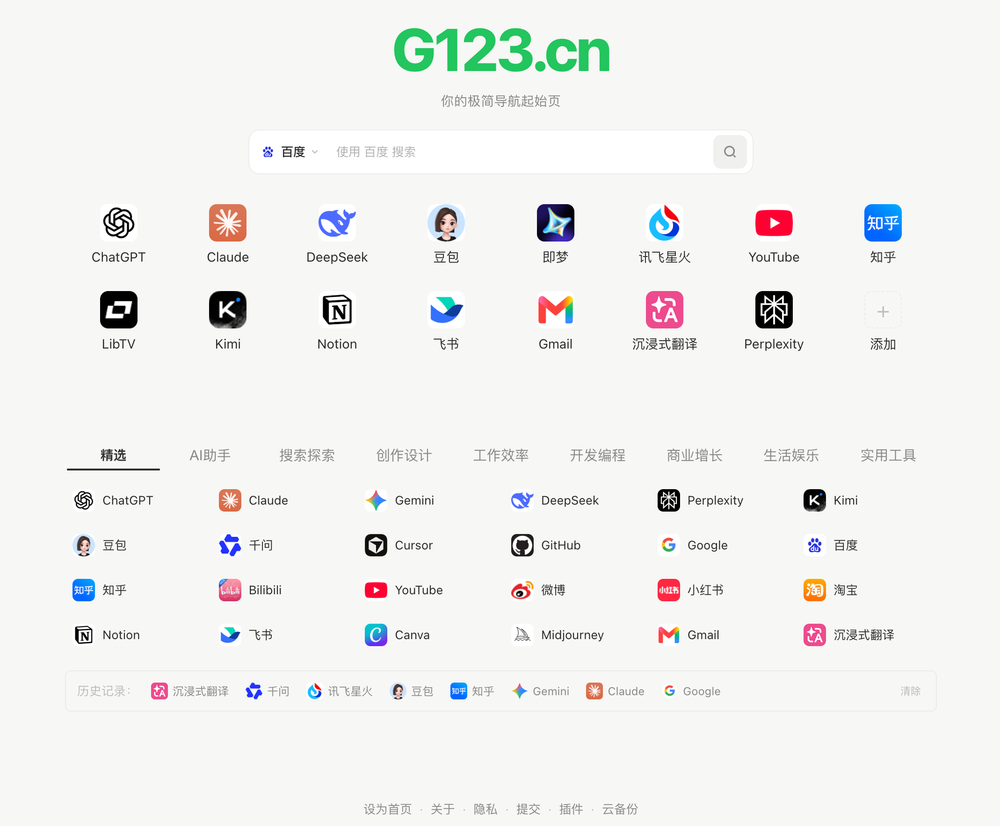

<p align="center">
  
</p>

<h1 align="center">G123.cn AI 工具导航</h1>

<p align="center">
  <a href="LICENSE"></a>
</p>

清爽的 AI 工具导航与个人网址主页：[https://g123.cn](https://g123.cn)

无注册、无弹窗广告。分类收录写作、绘画、视频、编程等 AI 工具，支持多引擎搜索、个人收藏与书签导入。

## 功能

- **分类导航** — 精选、写作、绘画、视频、编程、音乐、办公、设计、语音、营销、搜索、学习
- **多引擎搜索** — 百度、必应、Google 等，输入即搜
- **个人收藏** — 添加、排序、删除，数据存在浏览器本地
- **书签导入** — 从浏览器书签批量导入，快速搭好个人导航
- **主题与背景** — 亮色 / 暗色 / 跟随系统，可自定义背景色

## 本地预览

纯静态站点，无需构建工具：

```bash
python3 -m http.server 8080
```

浏览器打开 [http://localhost:8080/](http://localhost:8080/) 即可。

## 项目结构

```
├── index.html              # 首页 + SEO 静态导航
├── categories.js           # 分类与工具主数据（日常改这里）
├── favorites-defaults.js   # 新用户默认收藏
├── app.js                  # 首页交互逻辑
├── page.js / bg-palette.js # 子页与主题背景
├── style.css               # 样式
├── scripts/build-seo-nav.js# 根据 categories.js 同步 SEO 导航
├── about/ / privacy/ / submit/
└── 维护指南.md             # 增删改工具的详细步骤
```

## 维护

日常只需改 `categories.js`，然后同步 SEO 导航：

```bash
node scripts/build-seo-nav.js
```

完整说明见 [维护指南.md](维护指南.md)。

## 友情链接

欢迎加个友链：

- [G123导航](https://g123.cn) — https://g123.cn

后续 2.0 版本会优先开源给加了外链的站长。

## 许可

[MIT](LICENSE) © 2026 G123.cn
